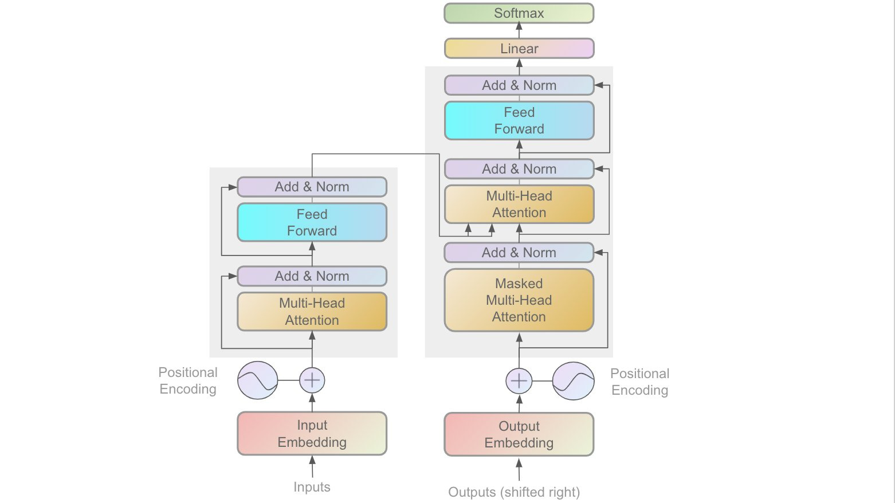

## Language Transformer model on Cover Letter

### Overview 
The transformer model is a sequential neural network architecture that can be used to generate text (such as GPT-3). The transformer model came along with 
a combination of encoder and decoder layers. 
However, in this project I am just using only
the decoder layer.

The masked self attention layer is formulated 
as:

$$
\text{softmax} \biggl(\frac{\mathbf{QK}^T + M}{\sqrt{d_k} 
} \biggr)\mathbf{V}
$$

## Text Data Preparation

The raw input data should be large enough 
to generate a proper sentence. 
I picked the `wikitext-2` dataset from 
🤗 datasets library.

## Requirements
- NVIDIA GPU with driver installed (Recommended)
- CUDA 11.7+, and CuDNN (Recommended)
- Pytorch 2.0
- Numpy

It does not matter if there is no NVIDIA Graphic card/CUDA driver installed in your local machine, the computation will still works with your CPU (But training process will took longer time).

[In case you wondering, here's my machine specs
- CPU: AMD Ryzen 5 5600X
- GPU: NVIDIA GeForce RTX 3060
- Memory: PNY XLR8 Gaming Epic 16GB (x2)
- Storage: Samsung Evo 980 NVME M.2 SSD (1Tb)
- Motherboard: Auros B550M Elite
- OS: Ubuntu 22.04.2 LTS 
]

## Speed and Performance

The entire large language model (LLM) was trained on a single GPU RTX 3060. The padded tokenized input is divided into 32 batches and we then apply batch training and compute categorized crossentropy loss on each of them, with epochs 100.

With 5000 iterations, this training process took around 12 mins to complete 
(may take shorter time if you had recent graphic cards).

## TODO
- [ ] Decode and generate PDF from input text
- [ ] Replace Positional Embedding with <b>Rotary Positional Embedding</b>
- [ ] Semantic analysis with Cosine Similarity based on input resume keywords
- [ ] Build docker container

## References
1. Attention is all you need. https://web.stanford.edu/class/archive/cs/cs224n/cs224n.1194/reports/custom/15839671.pdf
2. Building a tokenizer, block by block. https://huggingface.co/learn/nlp-course/chapter6/8?fw=pt
3. Coursera Deep Learning Specialization, week 4. Transformers. https://www.coursera.org/learn/nlp-sequence-models/home/week/4
